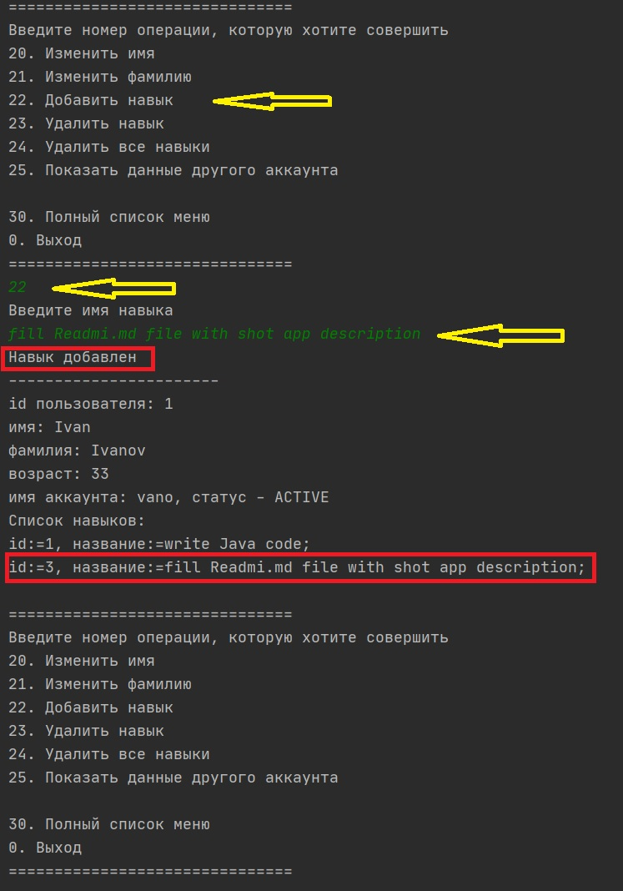

# CRUD_Application

---
Репозиторий содержит простые классы
1. ### **_Модель_**
    * Account
    * Developer
    * Skill
    * AccountStatus

    _Данные классы представляют модель данных, которыми пользуется приложение в процессе работы_
    
 2. ####  **_Классы реализующие доступ к репозиториям_** (txt файлам) в которых храняться данные для создания модели.
 
    * AccountAccess
    * DeveloperAccess
    * SkillAccess
    
    _Данные классы считывают (из/ записывают в) информацию из файлов при старте и в процессе работы приложения
    в случае неудачных попыток - сообщают об этом пользователю._
    
 3. ### Контроллеры
    
    * AccountController
    * DeveloperController
    * SkillController
    
    _Данные классы обрабатывают запросы от пользователя, фильтруют некоторые данные и возвращают текстовый результат работы._
    
 4. #### Классы Exceptions
 
    * AddAccountException
    * AddDeveloperException
    * SkillException
    
    _Данные классы никак не реализованы, просто принимают IOException как обёртка._
    
---

#### _Несколько простых шагов для работы в приложении_

1. Запустить метод main() в классе Application пакета src.app

    
    
    _Вам будет предложено два варианта_
    
    _Для того, чтобы продолжить, необходимо ввести цифру 1_
    
2. Затем перед пользователем откроется следующая информация

    
    
    _Необходимо ввести имя аккаунта "admin"_
    
3. Далее программа отображает текущие данные для данного аккаунта

    
    
    _**так же предлагаются дополнительные пункты меню с небольшим функционалом.**_
    
4. Для примера дальше приведена операция добавления навыка для текущего пользователя.

    
    
   #### _**навык добавляется в список, а данные сохраняются в репозитории.**_
    
    
    
    Далее необходимо следовать простым пунктам основного меню, для выхода ввести "0".